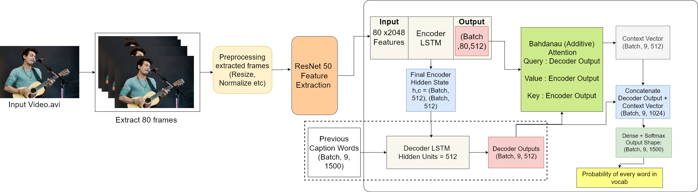
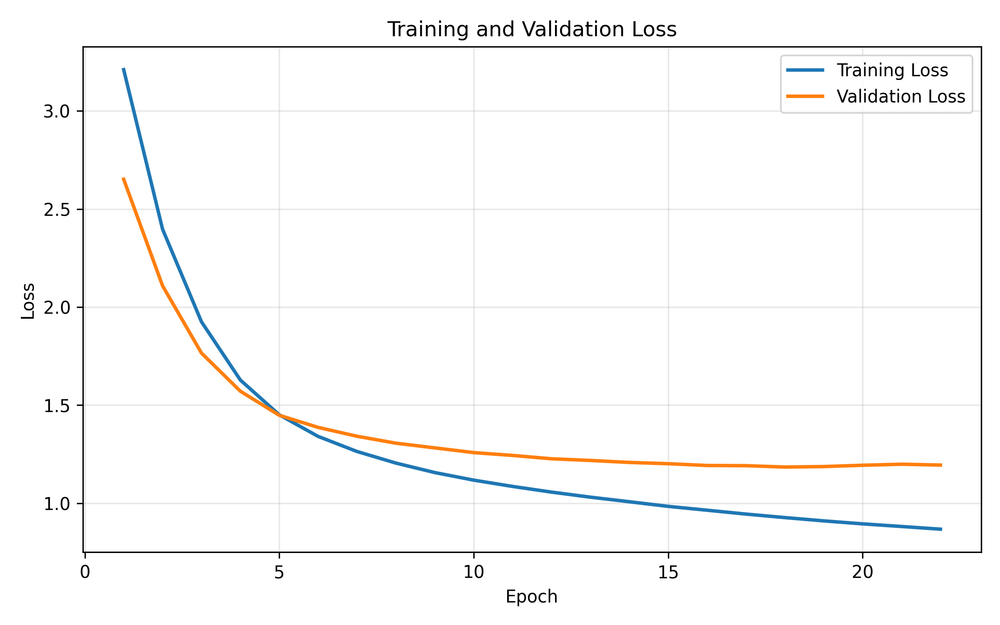
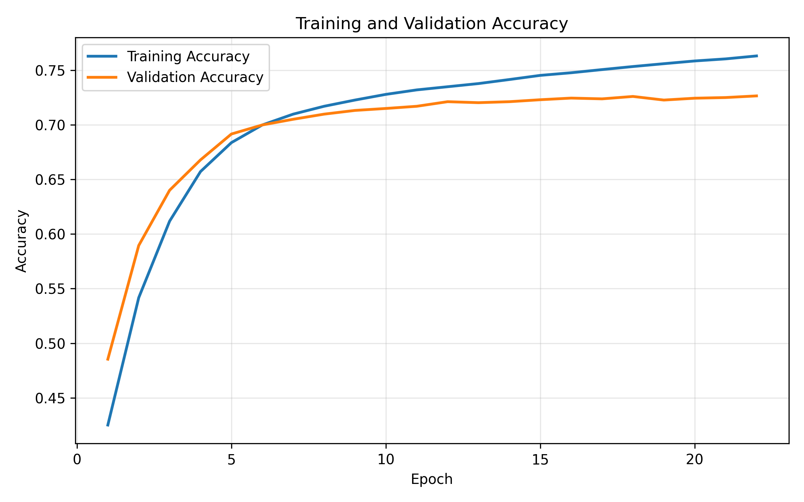

# Video-Captioning

Video captioning is the process of describing the content of a sequence of images
capturing its semantic relationships and meanings. This project implements a sequence-to-
sequence video caption generation approach built using Long Short-Term Memory (LSTM)
networks. A pre-trained ResNet50 CNN network, fine-tuned for this task, is used to extract
rich spatial features from individual video frames — ResNet50 mitigates the vanishing gradient
problem and captures richer, more discriminative spatial representations. To address the
limited long-term memory retention of standard LSTM decoders, a Bahdanau attention
mechanism is introduced to overcome the fixed-length context vector bottleneck of standard
LSTM encoder-decoders, allowing the model to focus on the most relevant frame at each step of
caption generation, thereby improving the quality and coherence of generated captions.

## Table of Contents
- [Dataset](#dataset)
- [Setup](#setup)
- [Usage](#usage)
- [Model](#model)
  - [Model Architecture](#model-architecture)
  - [Loss](#loss)
  - [Metric](#metric)
- [Performance](#performance)
- [Scripts](#scripts)
- [Future Development](#future-development)

## Example Demo
<p align="center">
  
</p>


## Dataset

This project is built on the [MSVD](https://huggingface.co/datasets/friedrichor/MSVD/tree/main) dataset.
It contains 1450 training videos and 100 testing videos.

## Setup

Clone the repository:
```bash
git clone https://github.com/ZZZ-SH0/Video-Captioning-using-Bahdanau-Attention
```

Move into the project directory:
```bash
cd Video-Captioning-using-Bahdanau-

https://github.com/user-attachments/assets/30ede03e-5c85-424e-ac4a-3c3966cb1be0


https://github.com/user-attachments/assets/2cc23524-89a8-4c95-9e7b-3bf86dc35eee

Attention
```

Create environment:
```bash
conda create -n video_caption python=3.7
```

Activate environment:
```bash
conda activate video_caption
```

Install requirements:
```bash
pip install -r requirements.txt
```

## Usage

To use the models that have already been trained:

Add a video to the `data/testing_data/your_videos` folder and run the predict realtime file:
```bash
python predict_realtime.py
```

For faster results, extract the features of the video first and save them in the `feat` folder of `testing_data`.

To convert a video into features, run:
```bash
python extract_features.py
```

To train locally, run `train.py`, or use the `Video_Captioning.ipynb` notebook.

## Model

### Model Architecture

<p align="center"></p>

### Loss

This is the graph of epochs vs loss. The loss used is categorical crossentropy.

<p align="center"></p>

### Metric

This is the graph of epochs vs metric. The metric used is accuracy.

<p align="center"></p>

## Performance

Evaluation results on the MSVD test set:

| Metric  | Score  |
|---------|--------|
| BLEU-1  | 0.7906 |
| BLEU-2  | 0.6379 |
| BLEU-3  | 0.5260 |
| BLEU-4  | 0.4135 |
| METEOR  | 0.5753 |
| ROUGE-L | 0.6425 |

## Scripts

- **train.py** — contains the model architecture
- **predict_test.py** — checks predicted results and stores them in a text file along with the time taken for each prediction
- **predict_realtime.py** — checks the results in realtime
- **model_final** — folder containing the trained encoder model, tokenizer, and decoder model weights
- **features.py** — extracts 80 frames evenly spread across the video; each frame is processed by a fine-tuned ResNet50, producing a 2048-dimensional feature vector per frame, resulting in a `(80, 2048)` array per video. `config.py` contains all the configurations used.
- **Video_Captioning.ipynb** — the notebook used for training and building this project

## Future Development

- Using other pretrained models to extract features, especially ones made for understanding videos, like I3D
- Right now the model uses only 80 frames — improvements need to be made so it can work with longer videos too
- Adding a UI to the project

## References

- [SV2T paper (2015)](https://arxiv.org/abs/1505.00487)
- [Keras implementation](https://github.com/CryoliteZ/Video2Text)
- [Intelligent-Projects-Using-Python](https://github.com/PacktPublishing/Intelligent-Projects-Using-Python/blob/master/Chapter05)
